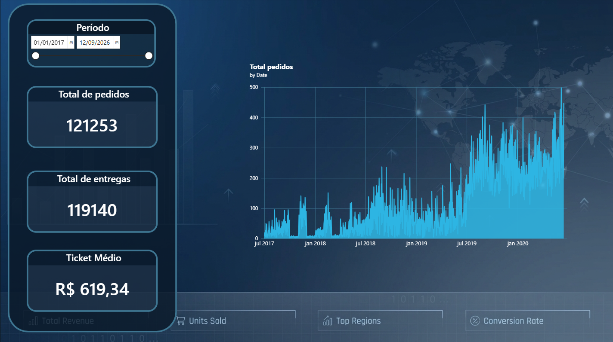

# Análise de vendas e entregas com Power BI

## Contexto

 - **Fonte dos dados:** Base fornecida durante o curso de "Power BI: modelagem de dados" da Alura.
 - **Objetivo da análise:** Analisar o volume de pedidos, a eficiência das entregas e o ticket médio por cliente.
 - **Perguntas-chave:** O ritmo de entrega acompanha o volume de pedidos? Existe algum gargalo logístico? Qual o valor médio gasto por compra?

## Ferramentas utilizadas

  - **Power Query:** Extração dos dados que vieram em CSV, limpeza e transformação dos dados (tratamento de datas, criação de chaves e remoção de duplicatas);
  - **Power BI Desktop:** Responsável pela modelagem de dados, criação dos relacionamentos e construção dos visuais;
  - **Dax:** Criação de medidas calculadas (Total de Pedidos, Total de Entregas e Ticket Médio) e colunas para hierarquia de datas (Ano e Mês);
  - **Power BI Helper:** Ferramenta de auditoria para verificar os relacionamentos e gerar a documentação técnica em M do projeto final.

## Estrutura do modelo

- **Arquitetura usada:** Modelo dimensional em Esquema Estrela
- **Organização das Tabelas Fatos:** O projeto foi dividido em duas partes:
   - 1. Fato Vendas (`fVendas`): Contém os dados transacionais de pedidos, preços e custos.
   - 2. Fato Estoque (`fEstoque`): Contém os dados de inventário e quantidade de produtos.
- **Relacionamentos e dimensões:** O modelo é composto pelas dimensões `dProduto`, `dCliente`, `dRevendedor`, `VendasTerritorio` e `dCalendario`.
- **Relacionamentos múltiplos:** A dimensão `dCalendario` possui três relacionamentos com a `fVendas`, permitindo analisar os dados por diferentes perspectivas de data:
    - Data do Pedido (PedidoVendaDataKey) - Relação Ativa.
    - Data de Vencimento (VencimentoDataKey) - Relação Inativa.
    - Data de Entrega (EntregaDataKey) - Relação Inativa.
- **Tratamento de Relacionamentos Inativos:** Para utilizar as datas de Vencimento e Entrega nas análises (como no cálculo do Total de Entregas), foi necessário o uso da função DAX USERELATIONSHIP. Isso permite ativar dinamicamente a relação inativa dentro do contexto de cálculo, sem precisar criar novas tabelas de data.

## Insights extraídos

 - A análise revelou que o ticket médio no período analisado (2017 a 2026) é de R$ 619,34, indicando que os clientes fazem compras de médio valor.
 - Além disso, o volume de entregas (119.140) é menor que o de pedidos (121.253), mostrando que 2.113 pedidos ainda não foram entregues (aproximadamente 1,74%) sugerindo que uma parcela dos pedidos ainda está em processo de entrega (seja por tempo de rota ou por possíveis atrasos logísticos).

### Recomendação

- Recomenda-se investigar os pedidos com status de "entrega pendente" para identificar se são atrasos logísticos ou cancelamentos, a fim de melhorar a taxa de conversão final.

***Este projeto demonstra a aplicação prática de modelagem dimensional e DAX para gerar insights acionáveis em um cenário real de vendas e logística. Além de ser um dashboard dinâmico com a capacidade de buscar por um período específico e assim seu visual será alterado instantaneamente***

## Arquivos do repositório

- **`projeto1.pbix`**: Arquivo do Power BI com o modelo e o dashboard final. *Para visualizar, faça o download e abra no Power BI Desktop.*
- **`dashboard.png`**: Print do dashboard final.
- **`documentação-modelagem.pdf`**: Documentação técnica gerada pelo Power BI Helper.
    - 📄 [Clique aqui para ver a documentação técnica completa (PDF)](documentação-projeto1.pdf)

## Autora

**Natália M. Santos**

